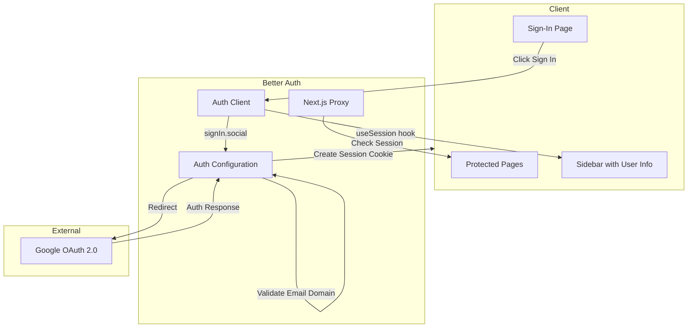

# Design Document: Google Sign-In

## Overview

This design implements Google OAuth authentication for the SPCS Dashboard using Better Auth, a modern authentication library for Next.js applications. The implementation follows SOLID, KISS, and DRY principles by leveraging Better Auth's built-in capabilities for session management, route protection, and OAuth flow handling.

Better Auth uses cookie-based session management and provides both server-side and client-side APIs for authentication. Since this application doesn't require persistent user storage beyond sessions, we'll use Better Auth's stateless session mode.

The architecture uses:

- **Better Auth** for authentication orchestration
- **Google OAuth Provider** for identity verification
- **Next.js 16 Proxy** for route protection (replaces middleware in Next.js 16+)
- **React hooks** for client-side session access

## Architecture



## Components and Interfaces

### 1. Auth Server Configuration (`lib/auth.ts`)

Central authentication configuration using Better Auth with Google provider and email domain validation.

```typescript
import { betterAuth } from 'better-auth';

export const auth = betterAuth({
  socialProviders: {
    google: {
      clientId: process.env.GOOGLE_OAUTH_CLIENT_ID!,
      clientSecret: process.env.GOOGLE_OAUTH_CLIENT_SECRET!,
    },
  },
  session: {
    cookieCache: {
      enabled: true,
      maxAge: 60 * 60 * 24 * 7, // 7 days
    },
  },
  user: {
    additionalFields: {
      // User fields from Google OAuth
    },
  },
  callbacks: {
    // Email domain validation in signIn callback
  },
});
```

### 2. Auth Client (`lib/auth-client.ts`)

Client-side authentication utilities using Better Auth React integration.

```typescript
import { createAuthClient } from 'better-auth/react';

export const authClient = createAuthClient();

export const { signIn, signOut, useSession } = authClient;
```

### 3. API Route Handler (`app/api/auth/[...all]/route.ts`)

Mounts Better Auth handler to handle all auth-related API requests.

```typescript
import { auth } from '@/lib/auth';
import { toNextJsHandler } from 'better-auth/next-js';

export const { POST, GET } = toNextJsHandler(auth);
```

### 4. Auth Proxy (`proxy.ts`)

Next.js 16+ uses `proxy.ts` instead of `middleware.ts`. Protects all routes under `/(main)` group using session validation with Node.js runtime support.

```typescript
import { NextResponse } from 'next/server';
import type { NextRequest } from 'next/server';
import { auth } from '@/lib/auth';

export async function proxy(request: NextRequest) {
  // Use Better Auth's getSession for full validation
  const session = await auth.api.getSession({
    headers: request.headers,
  });

  if (!session) {
    return NextResponse.redirect(new URL('/sign-in', request.url));
  }

  return NextResponse.next();
}

export const config = {
  matcher: ['/(main)/:path*'],
  runtime: 'nodejs',
};
```

### 5. Sign-In Page (`app/sign-in/page.tsx`)

Dedicated sign-in page with Google OAuth button.

```typescript
interface SignInPageProps {
  searchParams: {
    error?: string;
    callbackUrl?: string;
  };
}
```

### 6. Updated Sidebar (`components/nav/app-sidebar.tsx`)

Receives user data from Better Auth session via useSession hook.

```typescript
// Uses useSession() hook to get user data
const { data: session } = useSession();
const user = session?.user;
```

### 7. Email Validation Utility (`lib/auth-utils.ts`)

Pure function for validating email domain.

```typescript
export function isValidMumzworldEmail(email: string): boolean {
  return email.toLowerCase().endsWith('@mumzworld.com');
}
```

## Data Models

### Session Data Structure (from Better Auth)

```typescript
interface Session {
  user: {
    id: string;
    name: string;
    email: string;
    image?: string;
    emailVerified: boolean;
    createdAt: Date;
    updatedAt: Date;
  };
  session: {
    id: string;
    expiresAt: Date;
    token: string;
    createdAt: Date;
    updatedAt: Date;
    ipAddress?: string;
    userAgent?: string;
    userId: string;
  };
}
```

### Environment Variables

```
GOOGLE_OAUTH_CLIENT_ID=<google-client-id>
GOOGLE_OAUTH_CLIENT_SECRET=<google-client-secret>
BETTER_AUTH_SECRET=<random-secret-min-32-chars>
BETTER_AUTH_URL=<application-base-url>
```

## Correctness Properties

_A property is a characteristic or behavior that should hold true across all valid executions of a system—essentially, a formal statement about what the system should do. Properties serve as the bridge between human-readable specifications and machine-verifiable correctness guarantees._

### Property 1: Email Domain Validation Rejects Invalid Domains

_For any_ email address that does not end with "@mumzworld.com", the email validation function SHALL return false, rejecting the authentication attempt.

**Validates: Requirements 2.1**

### Property 2: Email Domain Validation Accepts Valid Domains

_For any_ email address that ends with "@mumzworld.com", the email validation function SHALL return true, allowing the authentication to proceed.

**Validates: Requirements 2.3**

### Property 3: Session Contains Required User Data

_For any_ valid Google OAuth user response containing name, email, and image, the created session SHALL contain all three fields with matching values.

**Validates: Requirements 1.4**

### Property 4: Unauthenticated Requests Are Redirected

_For any_ request to a protected route without a valid session, the proxy SHALL redirect to the sign-in page.

**Validates: Requirements 3.1**

### Property 5: Authenticated Requests Are Allowed

_For any_ request to a protected route with a valid session, the proxy SHALL allow the request to proceed.

**Validates: Requirements 3.2**

### Property 6: Sidebar Displays Session User Information

_For any_ valid session with user data, the sidebar component SHALL render the user's name, email, and image (or fallback initials if no image).

**Validates: Requirements 4.1, 4.2, 4.3, 4.4**

## Error Handling

### Authentication Errors

| Error Scenario          | Handling Strategy                                                                                                 |
| ----------------------- | ----------------------------------------------------------------------------------------------------------------- |
| Invalid email domain    | Redirect to sign-in page with `error=access_denied` query param, display "Only @mumzworld.com emails are allowed" |
| Google OAuth failure    | Redirect to sign-in page with `error=oauth_error` query param, display generic error message                      |
| Session expired/missing | Proxy redirects to sign-in page with original URL as `callbackUrl`                                                |
| Missing env variables   | Application fails to start with descriptive error in console                                                      |

### Error Display Component

The sign-in page will display error messages based on the `error` query parameter:

```typescript
const errorMessages: Record<string, string> = {
  access_denied: 'Only @mumzworld.com email addresses are allowed.',
  oauth_error: 'Authentication failed. Please try again.',
  default: 'An error occurred during sign-in.',
};
```

## Testing Strategy

### Unit Tests

Unit tests will verify specific examples and edge cases:

1. **Email validation function**
   - Test with valid @mumzworld.com emails
   - Test with invalid domains (gmail.com, other-company.com)
   - Test edge cases (empty string, null, malformed emails)

2. **Error message mapping**
   - Test each error code maps to correct message
   - Test fallback for unknown error codes

3. **User initials generation**
   - Test with various name formats
   - Test edge cases (single name, empty name)

### Property-Based Tests

Property-based tests will use fast-check to verify universal properties:

1. **Email domain validation** (Properties 1 & 2)
   - Generate random email strings
   - Verify validation result matches domain check
   - Minimum 100 iterations

### Integration Tests

Integration tests will verify component interactions:

1. **Proxy protection**
   - Test unauthenticated access to protected routes
   - Test authenticated access to protected routes

2. **Sign-in flow**
   - Test sign-in page renders correctly
   - Test error display with various error params

3. **Sign-out flow**
   - Test session termination
   - Test redirect after sign-out

### Test Configuration

- **Framework**: Jest with React Testing Library
- **Property Testing**: fast-check
- **Minimum iterations**: 100 per property test
- **Tag format**: `Feature: google-sign-in, Property {number}: {property_text}`
